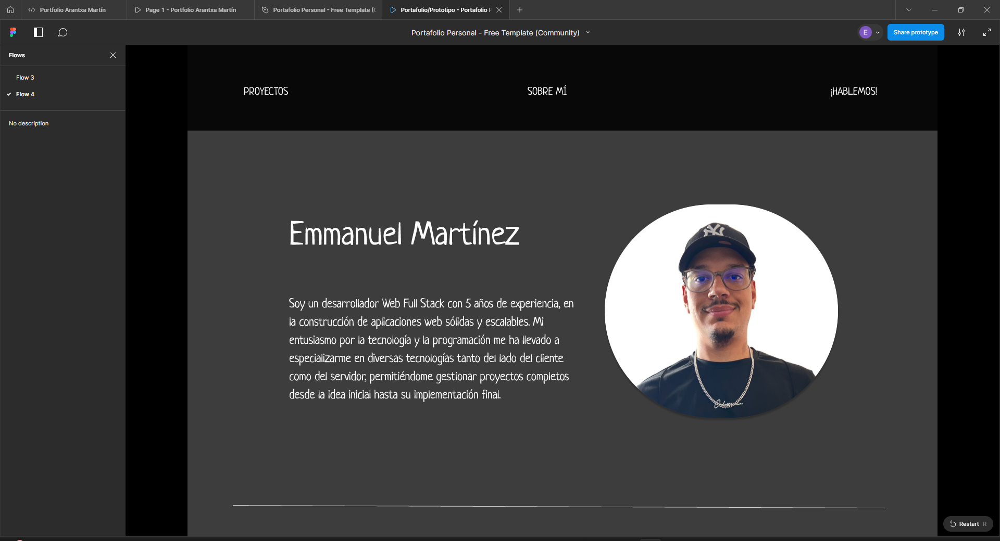
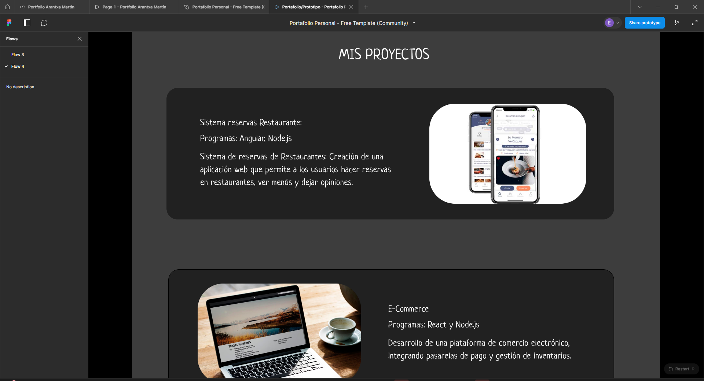
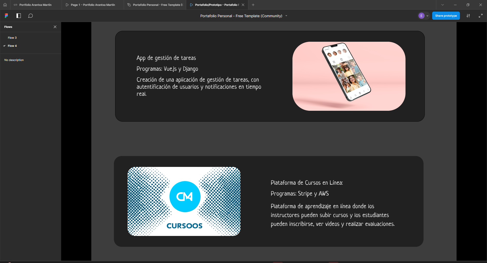
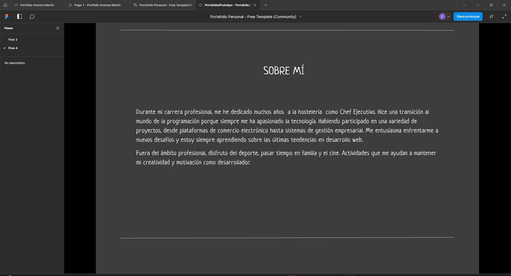
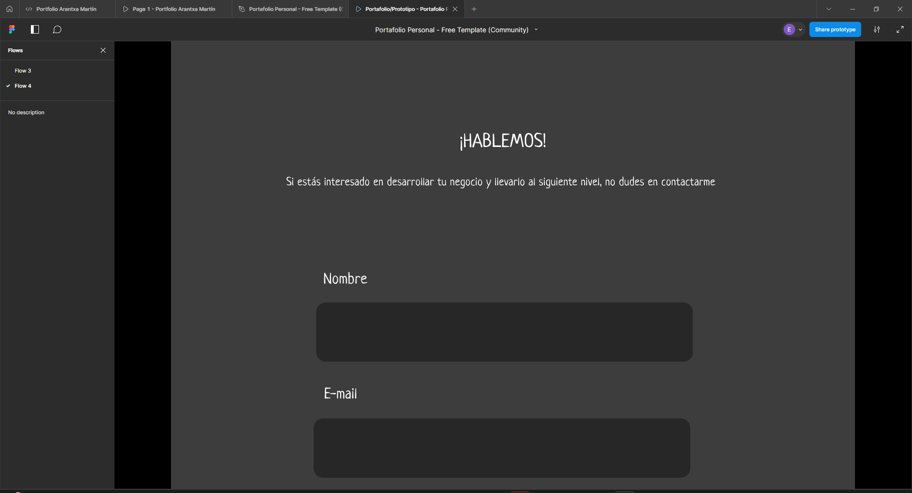
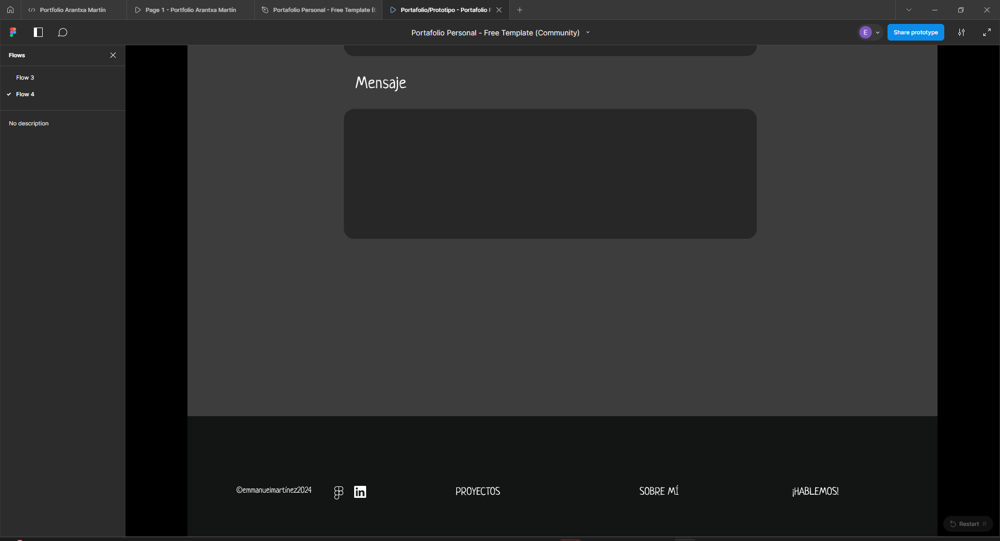

## Portfolio Emmanuel Martinez

Este repositorio contiene mi portafolio personal.

Fue diseñado en Figma por una compañera y maquetado por mi en HTML y CSS.

### Visualizalo:

1.-Descarga el repositorio:

```bash
git clone https://github.com/Rada749/Portfolio.git
```

2.- Usa tu navegador para visualizarlo

### Capturas del diseño en Figma















